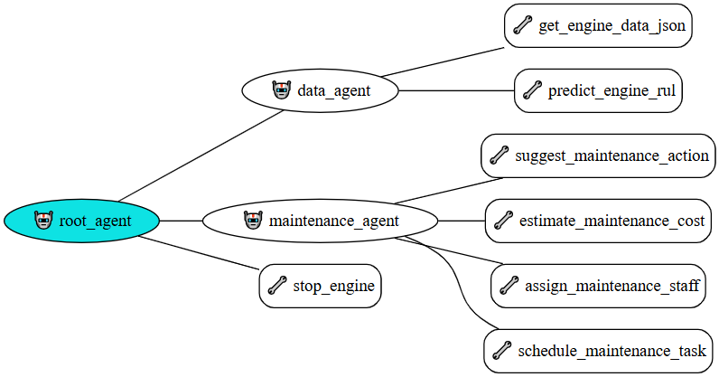

# 🏭 Talk to Your Factory

## An intent-based industrial automation simulation powered by Google ADK and the CMAPSS dataset.

- This project demonstrates the application of Agentic AI in industrial environments, enabling operators to interact with complex systems through natural language. Built using Google ADK and a modular agent architecture, it translates high-level business or operational intents into actionable tasks—such as predictive maintenance and system control.
---



---

## 🚀 Features

- 🧠 Intent-based natural language interaction
- 🔍 Query engine status
- 🔧 Predict Remaining Useful Life (RUL)
- 🛑 Simulate engine shutdowns
- 📅 Schedule maintenance actions  
- 🤖 Modular multi-agent architecture (root agent + sub-agents)
- 📊 Backed by the CMAPSS aircraft engine degradation dataset

---

## 🛠️ Getting Started

### Requirements

- Python 3.10+
- [Google ADK](https://github.com/google-deepmind/adk)
- (Optional) GitHub Codespaces for cloud-based execution

### Installation

```bash
git clone https://github.com/yourusername/talk-to-your-factory.git
cd talk-to-your-factory
pip install -r requirements.txt
````

#### Environment Configuration

Before running the app, create a `.env` file in the root directory with the following content:

```env
GOOGLE_GENAI_USE_VERTEXAI=FALSE
GOOGLE_API_KEY=<your-API-key-here>
```

> 💡 Set `GOOGLE_GENAI_USE_VERTEXAI=FALSE` to use the public Gemini API instead of Google Cloud Vertex AI. Make sure you have a valid API key from Google Generative AI.


### Run the App

```bash
adk web
```

Access the ADK web interface and begin interacting using natural language.

---

## 🧪 Example Prompt

```text
I need to maintain all the engines working well according to their predicted RUL, avoiding unexpected stops. Please create a consolidated predictive maintenance plan in table format.
```

### 💡 Sample of Output

| Engine ID | Recommended Action | Priority  | Estimated Cost (USD) | Labor Hours | Assigned Staff                    | Scheduled Time         |
|-----------|--------------------|-----------|-----------------------|-------------|----------------------------------|------------------------|
| 1         | MONITOR            | low       | 0                     | 0           | junior_mechanic                  | Schedule within 7 days |
| 2         | MONITOR            | low       | 0                     | 0           | junior_mechanic                  | Schedule within 7 days |
| 3         | MONITOR            | low       | 0                     | 0           | junior_mechanic                  | Schedule within 3 days |
| 4         | MONITOR            | low       | 0                     | 0           | junior_mechanic                  | Schedule within 7 days |
| 5         | MONITOR            | low       | 0                     | 0           | junior_mechanic                  | Schedule within 7 days |
| 6         | MONITOR            | low       | 0                     | 0           | junior_mechanic                  | Schedule within 7 days |
| 7         | MONITOR            | low       | 0                     | 0           | junior_mechanic                  | Schedule within 7 days |
| 8         | MONITOR            | low       | 0                     | 0           | junior_mechanic                  | Schedule within 7 days |
| 9         | MONITOR            | low       | 0                     | 0           | junior_mechanic                  | Schedule within 7 days |
| 10        | MONITOR            | low       | 0                     | 0           | junior_mechanic                  | Schedule within 7 days |
| 11        | MONITOR            | low       | 0                     | 0           | junior_mechanic                  | Schedule within 7 days |
| 12        | MONITOR            | low       | 0                     | 0           | junior_mechanic                  | Schedule within 7 days |
| 13        | MONITOR            | low       | 0                     | 0           | junior_mechanic                  | Schedule within 7 days |
| 14        | MONITOR            | low       | 0                     | 0           | junior_mechanic                  | Schedule within 7 days |
| 15        | MONITOR            | low       | 0                     | 0           | junior_mechanic                  | Schedule within 7 days |
| 16        | MONITOR            | low       | 0                     | 0           | junior_mechanic                  | Schedule within 7 days |
| 17        | REPAIR             | high      | 6000                  | 4           | mechanic, junior_mechanic        | Schedule within 3 days |
| 18        | REPAIR             | high      | 6000                  | 4           | mechanic, junior_mechanic        | Schedule within 3 days |
| 19        | MONITOR            | low       | 0                     | 0           | junior_mechanic                  | Schedule within 7 days |
| 20        | STOP               | critical  | 15000                 | 8           | tech_lead, senior_mechanic       | IMMEDIATE (0–1 days)   |
---

## 📚 References

* [CMAPSS Dataset – NASA Prognostics Data Repository](https://www.nasa.gov/content/prognostics-center-of-excellence-data-set-repository)
* Saxena, A., et al. “Damage Propagation Modeling for Aircraft Engine Run-to-Failure Simulation.” (2008).
* [Google ADK Documentation](https://google.github.io/adk-docs/)

---

## 🤝 Contributing

Contributions and improvements are welcome! Feel free to fork the repository, submit pull requests, or open issues for suggestions and bugs.

---

## 📄 License

This project is licensed under the MIT License.

